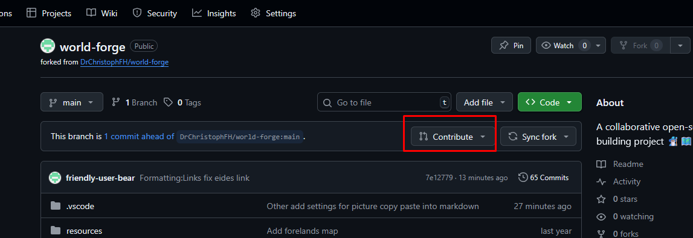

# ✨Beginners Guide✨

In case you have any questions, feel free to reach out for help! Either on GitHub or on the [Discord server](https://discord.gg/2BNzRGAwkj). I will be glad to help 🤗

## Introduction to Git and GitHub

**Git** is a tool that helps people keep track of changes to files over time. You can think of it as a "save history" for projects — it remembers every change you make, so you can go back to earlier versions if you need to.

**GitHub** is a website where people store Git projects online. It's a bit like cloud storage, but built specifically for projects that may have many versions, and where multiple people can work together without overwriting each other's work.

---

### Key Terms

* **Repository (Repo)**
  A repository is like a project folder that Git is keeping track of. It contains all the files, plus the entire history of changes made to them.

* **Commit**
  A commit is like saving a snapshot of your project at a specific point in time. Each commit has a message describing what was changed, so you can remember later.

* **Branch**
  A branch is a separate "copy" of the project inside the same repository where you can make changes without affecting the main version. Later, if you're happy with your changes, you can merge them back into the main branch.

---

### What is a Fork?

**Forking** is when you make your own copy of someone else's repository on GitHub.

You can then change your copy without affecting the original. This is useful if you want to experiment, contribute to someone's project, or just have your own version to work on.

## Step By Step Guide

### Forking the World Forge Repository

1. Go to the repository page on [GitHub](https://github.com/DrChristophFH/world-forge).
2. Click the "Fork" button in the top right corner. This creates a copy of the repository in your own GitHub account. 
3. Press the "Create fork" button to confirm. 

### Cloning your Repository (Fork)

To start working on the project, you need to clone the forked repository to your local machine. This means downloading a copy of the project files so you can work on them.

1. Go to the repository page on [GitHub](https://github.com/DrChristophFH/world-forge).
2. Click the green "Code" button. 
3. Copy the URL provided. 
4. Open your terminal (or Git Bash) and run the following command in the folder where you want to clone the repository (replace `<URL>` with the URL you copied):

```
git clone <URL>
```

The first time you do this a window will pop up asking you to sign in:


Click "Sign in with your browser" and then "Authorize git-ecosystem"


This will save your credentials on your PC for the future as well.

5. This will create a folder named `world-forge` in your current directory, containing all the files from the repository.
6. If you have Visual Studio Code installed, you can open the cloned repository by running in the terminal after cloning:

```
code .\world-forge\
```

Or you can open Visual Studio Code and use the "Open Folder" option to select the `world-forge` folder.

When you open the folder the first time Visual Studio Code might ask you to trust the authors of the files in the folder. This is a security feature to prevent untrusted code from running on your machine. As we are working with only markdown files, you can safely trust the authors.


> [!NOTE]
> When you open Visual Studio Code the first time, it may ask you to install some recommended extensions for working with Git and other features. It's a good idea to install these extensions to enhance your development experience.

### Making a Change

Once you have made some changes you can commit them. If you are new to Git I would strongly advise you to use Visual Studio Code's built-in Git features to help you with this process, as you get a nice visual representation of the changes you're making.

Changes will appear in the Source Control panel on the left.


There you will see a list of your changes. You can stage them by clicking the "+" icon next to each file. Staging means selecting the changes you want to include in your next commit. So you can actually have a lot of changes already, but only commit a small subset of them 😊

If you want to see your changes hierarchical you can press the following small button at the top:


Resulting in the following view:


When you have added all the changes you want to commit to "Staged Changes", you can enter a commit message in the text box at the top. This message should briefly describe the changes you made, so you (and others) can understand what this commit does later on. For some guidelines check out [our contribution guidelines](/wiki/guides/Git.md#commit-messages).


Once you have done that, you can click the checkmark icon to commit your changes.


Now the commit is created. But you won't see it online yet! To do that, you need to push your changes to your forked repository on GitHub. This can be done with the next button that follows after the commit button.


### Merging back your Changes into the original World Forge Repository

Once you have made all your changes, committed them and pushed them to your forked repository on GitHub, you can create a pull request to merge your changes back into the original World Forge repository.

1. Go to your forked repository on GitHub.
2. You should see a banner that lists how many commits you have ahead of the original repository (and how many behind), there click "Contribute" 